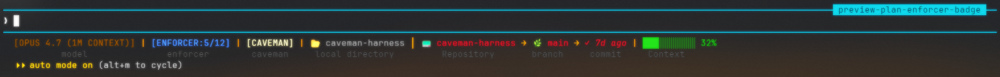
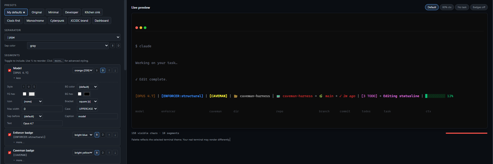

# .statusline

A two-line, live-data statusline for Claude Code — with a browser playground to
design your own and share it with teammates.

**Live in your terminal:**



**Design it in the browser:**



## Quick start

Most people do not need to hand-edit the hook. The normal flow is:

1. Install the hook once:

   ```bash
   bash ~/.statusline/install.sh --yes
   ```

2. Open the playground and click **Link Claude** once.
3. Pick your `~/.claude` folder when the browser asks.
4. Tune a preset and hit **Save**.
5. After that, just run:

   ```bash
   /statusline-preset       # list your saved presets
   /statusline-preset all   # show built-ins too
   /statusline-preset NAME  # switch to a preset by name
   ```

Important:

- **Save** in the playground is browser-only until you link Claude.
- If your browser cannot link local files directly, use **Import** as the fallback.

## What's different

- **Two lines.** The first is your live statusline; the second is a dim caption
  row, width-aligned under each segment. No other statusline does this (Claude
  Code's multi-line renderer isn't documented — we spike-tested it).
- **Live from Claude's own local data.** Session tokens, cost, cache hit %, and
  today's spend come from Claude Code's `~/.claude/projects/<cwd>/<session>.jsonl`
  files. Native 5-hour and weekly quota data come from the statusline JSON on
  stdin via `data.rate_limits`.
- **Everything's a skippable segment.** No ledger? No `[ENFORCER]` badge. No
  git repo? No branch or repo name. Segments drop cleanly and take their
  separators with them.
- **Per-segment styling.** Color (16 + truecolor), bold, dim, italic,
  underline, strikethrough, background color, icon prefix, bracket style, case
  transform (UPPER / lower / Title), caption, custom separator-before,
  alignment (center / left / right), max width with middle-ellipsis truncation.
- **Playground.** A single HTML file with live preview, 8+ presets, 9 terminal
  themes, undo/redo, URL-sharing, browser-saved presets, a one-time `Link
  Claude` flow so normal `Save` shows up in `/statusline-preset`, an `Import`
  fallback that copies `/statusline-preset import ...`, and a "copy prompt"
  button that emits a natural-language instruction for Claude Code to rewrite
  your hook.

## Install

### 1. Clone

```bash
git clone https://github.com/jccidc/.statusline ~/.statusline
```

### 2. Install it into Claude Code

```bash
bash ~/.statusline/install.sh --yes
```

Interactive mode is also available:

```bash
bash ~/.statusline/install.sh
```

The installer:

- Backs up existing hook/helper files before replacing them.
- Copies the live hook to `~/.claude/hooks/statusline.js` and
  `~/.claude/hooks/gsd-statusline.js`.
- Copies the preset helper to `~/.claude/statusline/statusline-preset.js`.
- Copies shared preset definitions to
  `~/.claude/statusline/statusline-preset-common.js`.
- Installs the slash-command skill at
  `~/.claude/skills/statusline-preset/SKILL.md`.
- Optionally wires `~/.claude/settings.json` to run the hook.

### 3. Wire it into Claude Code

If `install.sh` updated `~/.claude/settings.json` for you, skip this section.
Manual wiring looks like this:

```json
{
  "statusLine": {
    "type": "command",
    "command": "node \"$HOME/.claude/hooks/statusline.js\""
  }
}
```

On Windows + Git Bash, use the forward-slash path:
`node "C:/Users/<you>/.claude/hooks/statusline.js"`.

### 4. Restart Claude Code

Start a new Claude Code session. You now have:

```bash
/statusline-preset                 # list saved presets
/statusline-preset all             # show saved + built-in presets
/statusline-preset NAME            # activate a preset by name
/statusline-preset import PAYLOAD  # import + activate a playground preset
```

### 5. (Optional) Caveman-mode flag

The `[CAVEMAN]` badge only renders when `~/.claude/.caveman-active` exists.
To toggle:

```bash
touch ~/.claude/.caveman-active   # on
rm    ~/.claude/.caveman-active   # off
```

### 6. (Optional) Preview the Plan Enforcer badge

The `[ENFORCER:N/M]` badge shows real progress from a project's
`.plan-enforcer/ledger.md`. To preview the look without setting up a real
ledger:

```bash
echo "3/7" > ~/.claude/.enforcer-preview   # on, with placeholder value
rm ~/.claude/.enforcer-preview             # off
```

Real ledgers always win over the preview flag.

### 7. (Optional) Uninstall / restore the last backup

```bash
bash ~/.statusline/install.sh --uninstall
```

### 8. Manual install fallback

```bash
mkdir -p ~/.claude/hooks ~/.claude/statusline ~/.claude/skills/statusline-preset
cp ~/.statusline/hook/statusline.js ~/.claude/hooks/statusline.js
cp ~/.statusline/hook/statusline.js ~/.claude/hooks/gsd-statusline.js
cp ~/.statusline/shared/statusline-preset-common.js ~/.claude/statusline/statusline-preset-common.js
cp ~/.statusline/scripts/statusline-preset.js ~/.claude/statusline/statusline-preset.js
cp ~/.statusline/.claude/skills/statusline-preset/SKILL.md ~/.claude/skills/statusline-preset/SKILL.md
chmod +x ~/.claude/statusline/statusline-preset.js
```

## Design your own

Open the playground in any browser:

```bash
# macOS
open  ~/.statusline/playground/index.html

# Windows
start ~/.statusline/playground/index.html

# Linux
xdg-open ~/.statusline/playground/index.html
```

- Pick a preset, or start from `My defaults ★` and edit from there.
- Hit **Load** to reopen presets saved in this browser.
- Hit **Link Claude** once to pick your `~/.claude` folder. After that, normal
  **Save** syncs browser presets into Claude so `/statusline-preset` can see
  them directly.
- Click "more…" on any segment to expand advanced styling (italic, bg color,
  truecolor hex, icon, bracket, case, sep-before, caption, max width).
- Hit **🔗 Share** to copy a URL with your full state embedded; hand the URL
  to anyone who has the playground HTML and their playground loads your exact
  setup.
- Hit **💾 Save** to stash a custom preset in browser `localStorage`. If Claude
  is linked, the same save also syncs into `~/.claude/statusline-presets.json`.
- Use `/statusline-preset` to list your saved presets, `/statusline-preset all`
  to show built-ins too, or `/statusline-preset NAME` to switch instantly
  inside Claude Code.
- Hit **Import** only if you want the fallback `/statusline-preset import ...`
  command instead of direct Claude syncing.
- Hit **Copy** only if you explicitly want a natural-language prompt that asks
  Claude Code to rewrite the hook file itself.

The linked-save workflow above is the current source of truth.
[`docs/STATUSLINE.md`](docs/STATUSLINE.md) is lower-level renderer background.

## Share your statusline

Seven paths, ranked by recipient friction:

1. **URL share** — playground → 🔗 Share → send the URL. Recipient has the
   playground HTML → pastes URL → loads your setup verbatim.
2. **Linked save** — playground → **Link Claude** once → later **Save**.
   Claude can then list and switch those presets directly with
   `/statusline-preset NAME`.
3. **Import command** — playground → **Import** → send them the
   `/statusline-preset import ...` command. They paste once, then use
   `/statusline-preset NAME` after that.
4. **Send playground HTML + URL** — email/Slack them `playground/index.html`
   plus the share URL. Fully offline.
5. **Copy the prompt** — playground → switch output to "Prompt" → Copy → paste
   into their Claude Code session. Claude rewrites their hook. Zero tooling
   needed on their end.
6. **Send the JSON config** — playground → output "JSON" → Copy. A raw config
   artifact.
7. **Send the hook file** — `hook/statusline.js` directly. Most accurate, most
   invasive.

## Segments available

All of these render live from real data on your machine. Any segment with no
data simply skips (no empty slot, no dangling separator):

| Segment              | Source                                                  |
| -------------------- | ------------------------------------------------------- |
| Model                | `data.model.display_name` from stdin                    |
| Caveman badge        | `~/.claude/.caveman-active` flag                        |
| Enforcer progress    | `.plan-enforcer/ledger.md` scoreboard (walk-up)         |
| Enforcer preview     | `~/.claude/.enforcer-preview` flag (placeholder)        |
| GSD update notice    | `~/.cache/gsd/gsd-update-check.json`                    |
| Local directory      | `data.workspace.current_dir`                            |
| Repo name            | `git rev-parse --show-toplevel` basename                |
| Git branch           | `git rev-parse --abbrev-ref HEAD`                       |
| Last commit age      | `git log -1 --format=%ct` relative                      |
| TODO count           | `~/.claude/todos/<session>-agent-*.json`                |
| Current task         | same todos file, `in_progress` entry                    |
| Context bar          | `data.context_window.remaining_percentage`              |
| Session tokens       | session JSONL usage totals                              |
| Session cost         | session JSONL × price table                             |
| Cache hit %          | session JSONL `cache_read` ÷ total input                |
| Today's cost         | all-session JSONL scan, mtime-filtered, 60s cache       |
| 5h quota             | `data.rate_limits.five_hour` from Claude stdin          |
| Weekly quota         | `data.rate_limits.seven_day` from Claude stdin          |
| Messages / 5h (local) | all-session JSONL scan, timestamp-filtered, 60s cache  |

## Configuration knobs

| File                                  | Purpose                                  |
| ------------------------------------- | ---------------------------------------- |
| `~/.claude/hooks/statusline.js`       | Installed live hook                      |
| `~/.claude/hooks/gsd-statusline.js`   | Alternate live hook path used by many setups |
| `~/.claude/statusline-presets.json`   | Linked playground saves + imported custom presets |
| `~/.claude/.statusline-active-preset` | Active preset name the hook renders      |
| `~/.claude/skills/statusline-preset/` | Slash-command wiring for preset switching |
| `~/.claude/settings.json`             | Wires Claude Code to run the hook        |
| `~/.claude/.caveman-active`           | Toggles the `[CAVEMAN]` badge            |
| `~/.claude/.enforcer-preview`         | Forces `[ENFORCER:N/M]` with a value     |
| `<project>/.plan-enforcer/ledger.md`  | Real enforcer progress (walk-up)         |
| `~/.claude/todos/<sess>-agent-*.json` | TODOs + current task                     |
| `~/.claude/projects/<cwd>/*.jsonl`    | Session logs — usage/cost/cache source   |
| `os.tmpdir()/claude-statusline-agg.json` | Cross-session cost/msg cache (60s TTL) |

## Performance

The hook re-runs every message and tool call, so it has to be fast:

- Git subprocesses: `execSync` with 400ms timeout, fail-silent.
- Cross-session log scan: mtime-gated per file, cached in `os.tmpdir()` for
  60s. Only files touched today or within the 5-hour window are parsed.
- All ANSI is written to stdout in a single buffered write.
- Target: < 60ms cold, < 10ms warm (cache hit).

If your bar ever feels laggy, delete the agg cache to force a refresh
(`rm "$TMPDIR/claude-statusline-agg.json"`) or grep for long-running
`execSync` calls.

## Compatibility

- Tested on Windows 11 + Git Bash, macOS, Linux (Ubuntu).
- Node 18+.
- Terminals: Windows Terminal, iTerm2, Alacritty, Kitty, VS Code terminal.
- Multi-line is a Claude Code feature; it will look wrong in terminals that
  don't do what Claude Code expects on `\n`. Disable the caption line in
  `statusline.js` if you hit that by setting all `caption` fields to empty
  strings.

## License

MIT. See [LICENSE](LICENSE).
